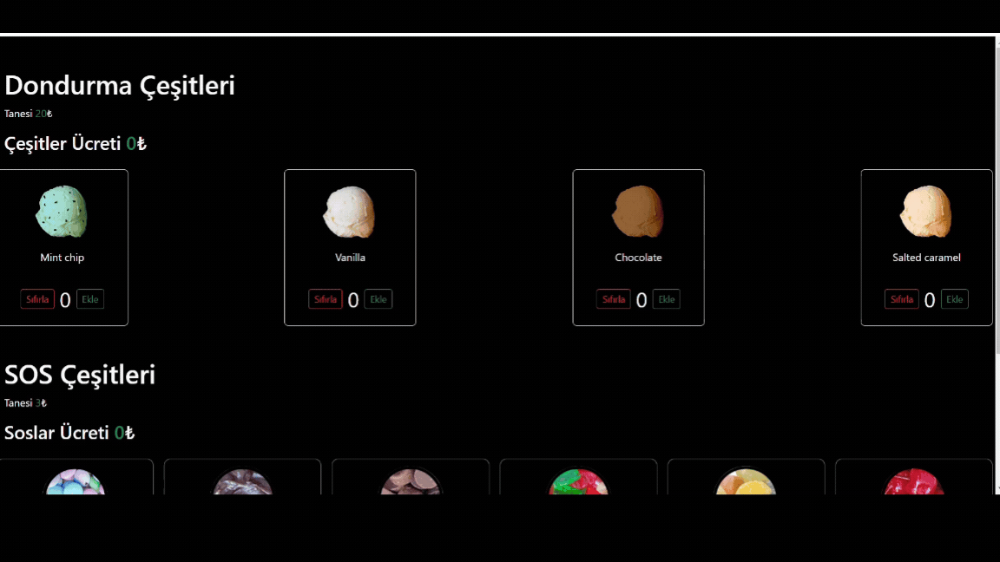

## unitest ice-cream-app

Bienvenue dans l'Application de Crème Glacée! Cette application permet aux utilisateurs de découvrir diverses saveurs de crème glacée et de créer leurs propres combinaisons de sauces spéciales. Que vous soyez un amateur de crème glacée ou à la recherche d'un projet amusant, cette application est faite pour vous!

### Technologies et Bibliothèques Utilisées

- json-server: Pour simuler un backend avec une API basée sur JSON.
- bootstrap: Pour fournir des styles et des composants pour l'interface utilisateur.
- axios@^0.27.2: Pour gérer les requêtes API.
- @testing-library/user-event@14.0: Pour tester les interactions utilisateur

### Fonctionnalités

Découverte de Saveurs de Crème Glacée: Voir diverses saveurs de crème glacée.
Création de Combinaisons de Sauces Spéciales: Créez vos propres combinaisons de sauces.
Interface Utilisateur Conviviale: Interface simple et conviviale.
Tests Unitaires: Comprend des tests unitaires pour garantir la fiabilité et la fonctionnalité de l'application.

### Tests Unitaires

Des tests unitaires ont été écrits pour assurer la fiabilité et la fonctionnalité de l'Application de Crème Glacée. Ces tests sont conçus pour vérifier que chaque composant de l'application fonctionne correctement. Ils vérifient que les fonctions donnent les résultats attendus et que les situations d'erreur sont correctement gérées.

